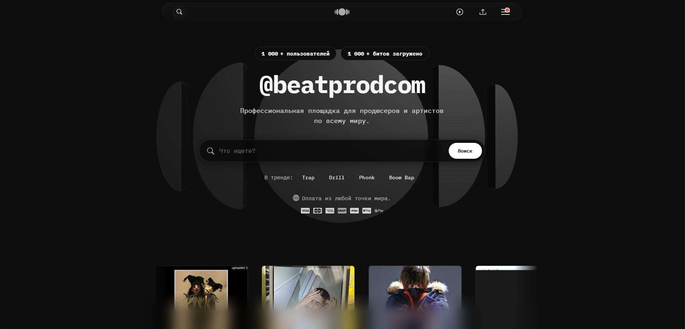
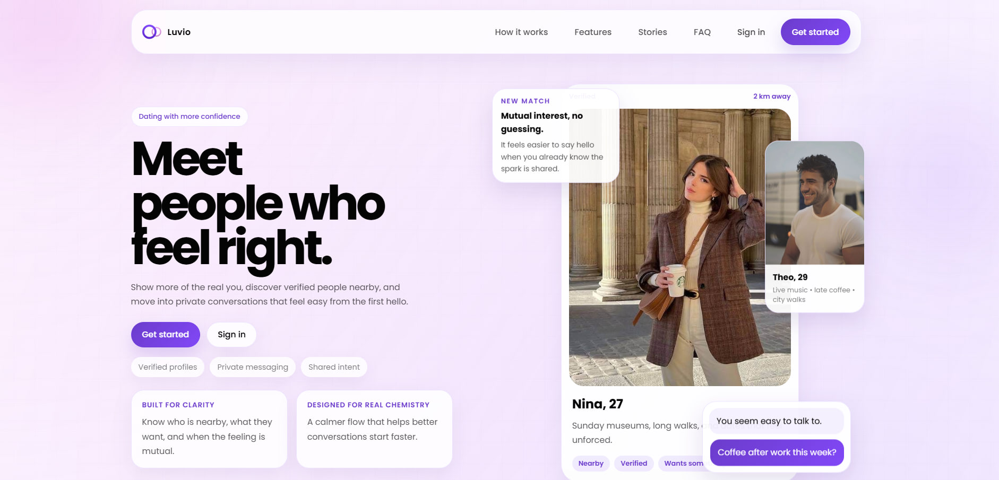
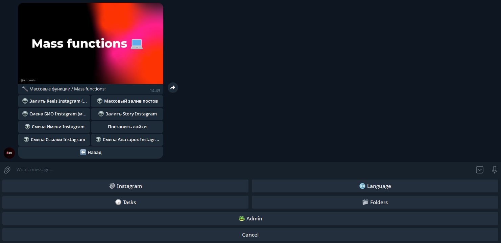

<div align="center">

  

  <h1>Nikita / GrekF3</h1>
  <h3>Fullstack Developer · Automation Engineer · Product Builder</h3>

  <p>
    Python-first backend, Next.js interfaces, bots, internal tools, AI workflows, and production systems.
  </p>

  <p>
    <a href="https://t.me/GrekF3">
      
    </a>
    <a href="https://github.com/GrekF3">
      
    </a>
  </p>

  <sub>Ало, это число? Нет, это строка.</sub>

</div>

---

## About Me

I build products where the boring parts matter: auth, APIs, queues, deployment, admin panels, business logic, integrations, and the small details that make a system usable every day.

Most of my recent work is private production code, so the public profile is a distilled version of the real work: web platforms, automation services, crypto tooling, Telegram-based systems, market screeners, content pipelines, and internal dashboards.

- Based in Krasnodar
- 80+ own repositories: mostly Python, TypeScript, JavaScript, HTML/CSS
- Strongest stack: Python, Django, DRF, FastAPI, Next.js, React, TypeScript, PostgreSQL, Redis, Docker, Nginx
- Main interests: automation, marketplaces, bot platforms, Web3, AI-assisted workflows, and systems that replace repetitive manual work

---

## What I Build

| Direction | What it means in practice |
| --- | --- |
| Product platforms | Fullstack apps with frontend, backend, auth, admin logic, payments, APIs, and deployment |
| Automation systems | Telegram bots, background workers, scheduled jobs, parsers, account workflows, alerts, and integrations |
| AI workflows | Content processing, rewrite/review pipelines, source-driven analysis, assistants, and internal operator tools |
| Marketplaces | Order flows, inventory logic, user dashboards, admin panels, and transaction-heavy business logic |
| Web3 tooling | Self-custodial wallet UX, local encryption, chain integrations, swaps, bridges, and provider APIs |
| DevOps | Docker Compose, production env contracts, nginx, Linux servers, PostgreSQL, Redis, logs, and release routines |

---

## Featured Work

<table>
  <tr>
    <td width="58%" valign="top">

### Silent Wallet

Open-source self-custodial crypto wallet for ETH, BTC, BNB Chain, and Solana.

Built with Next.js, React, TypeScript, Tauri, Capacitor, local encryption, provider route handlers, watch-only mode, balances, prices, token discovery, transaction history, testnets, swap/bridge flows, and fiat provider integrations.

The important part: private keys and seed phrases stay on the device.

**Stack:** Next.js · React · TypeScript · Tauri · Capacitor · Web3 APIs

[Repository](https://github.com/GrekF3/Silent-Wallet)

  </td>
  <td width="42%" valign="top" align="center">
    
  </td>
  </tr>
</table>

<br>

<table>
  <tr>
    <td width="58%" valign="top">

### Beatprod

Production platform where I work across backend, frontend, product features, reliability, and internal automation.

My focus is shipping real business functionality: API design, product UX, admin flows, integrations, deployment, and keeping the platform stable as features grow.

**Stack:** Python · Django/Flask · Next.js · React · TypeScript · PostgreSQL · Docker · Nginx

[Live project](https://beatprod.com/)

  </td>
  <td width="42%" valign="top" align="center">
    
  </td>
  </tr>
</table>

<br>

<table>
  <tr>
    <td width="58%" valign="top">

### Luvio

Dating MVP built around profiles, user interaction, matching flows, deployment config, and product docs.

The project is organized as a Django REST Framework backend with templates and production-oriented Docker setup. The focus is a clean foundation that can grow from MVP into a larger social product.

**Stack:** Django REST Framework · Templates · PostgreSQL · Docker · Production docs

  </td>
  <td width="42%" valign="top" align="center">
    
  </td>
  </tr>
</table>

<br>

<table>
  <tr>
    <td width="58%" valign="top">

### Autoreels

Telegram-controlled automation system for Instagram reels and account operations.

The project focuses on operator control, repeatable workflows, runtime isolation, server deployment, media/account handling, and keeping secrets plus runtime data outside the repository.

**Stack:** Python · Telegram Bot API · Automation workflows · Server runtime · systemd

  </td>
  <td width="42%" valign="top" align="center">
    
  </td>
  </tr>
</table>

---

## More Projects

| Project | Type | Notes |
| --- | --- | --- |
| [Silent Wallet](https://github.com/GrekF3/Silent-Wallet) | Web3 wallet | Public open-source wallet with desktop/mobile direction, local encryption, swap/bridge provider flows |
| Remade News | AI/media platform | Telegram news ingestion, truth checking, media handling, rewrite queue, FastAPI, Next.js, PostgreSQL, Redis |
| Re Forge | AI operating system | Pipeline engine, reviewer gates, citations, trend analyzer, content factory, FastAPI, Next.js, Temporal |
| Rubux / RBX platforms | Marketplace systems | Django/DRF APIs, Next.js frontends, order flows, inventory, Roblox helpers, Docker production setup |
| ODAMARKET | Marketplace | Django + DRF backend, Next.js frontend, PostgreSQL, nginx, Docker Compose |
| MEXC tools | Market automation | Symbol screeners, alerts, trading utilities, monitoring logic |
| [factorio-modloader](https://github.com/GrekF3/factorio-modloader) | Open-source tool | Factorio mod parsing/downloader idea inspired by RimPy |
| [tg_farm](https://github.com/GrekF3/tg_farm) | Telegram automation | Experimental Telegram bot farm |
| [trackboost](https://github.com/GrekF3/trackboost) | Startup demo | Public code demo from a startup experiment |

---

## Tech Stack

### Backend

<p align="center">
  
  
  
  
  
  
  
</p>

<p align="center">
  
  
  
  
  
</p>

### Frontend

<p align="center">
  
  
  
  
  
  
</p>

<p align="center">
  
  
  
  
</p>

### Infra and Tools

<p align="center">
  
  
  
  
  
</p>

<p align="center">
  
  
  
  
  
</p>

---

## Repository Map

```text
Python      55 repos  | backend, bots, automation, parsers, marketplaces
TypeScript  11 repos  | Next.js apps, product interfaces, dashboards
JavaScript   7 repos  | web experiments, bots, legacy frontend
HTML/CSS    11 repos  | landing pages, demos, static sites
C#           1 repo   | game prototype
```

---

## How I Work

- I prefer useful systems over pretty prototypes.
- I like when a project has a clear production path: env files, Docker, logs, docs, and rollback-friendly releases.
- I keep business logic explicit, because hidden rules become future bugs.
- I automate repetitive work when the same action happens more than a few times.
- I care about speed, but not at the cost of maintainability.

---

## GitHub Stats

<p align="center">
  
  
  
  
  
</p>

---

## Contact

<p align="center">
  <a href="https://t.me/GrekF3">Telegram</a> ·
  <a href="https://github.com/GrekF3">GitHub</a>
</p>
