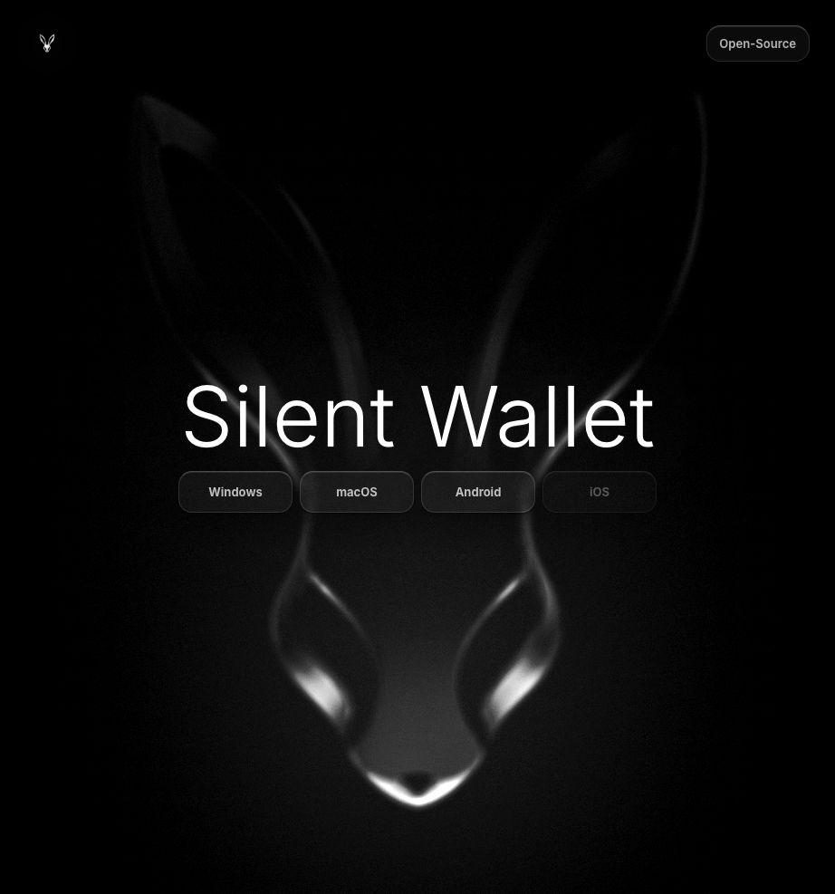
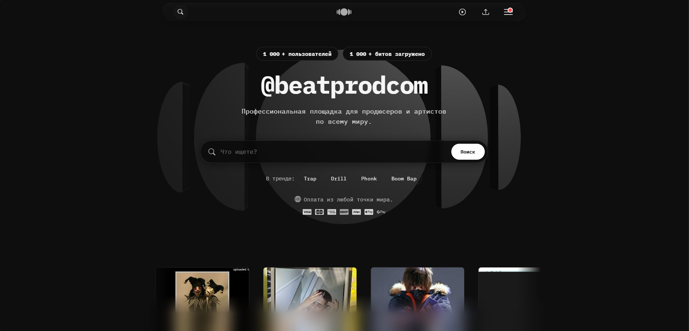

  <h1>Nikita / GrekF3</h1>
  <h3>Full-stack Developer · Automation Engineer · Product Builder</h3>

  
Python-first backend, Next.js interfaces, automation, integrations, and production systems.

  

    <a href="https://grekf3.github.io/">Portfolio</a>
    ·
    <a href="https://t.me/GrekF3">Telegram</a>
  

  Ало, это число? Нет, это строка.

## Selected work

<table>
  <tr>
    <td width="58%" valign="top">

### Silent Wallet

Open-source self-custodial wallet for ETH, BTC, BNB Chain, and Solana. The application includes local encryption, desktop and mobile packaging, transaction history, testnets, watch-only mode, and provider integrations.

**Stack:** Next.js · React · TypeScript · Tauri · Capacitor

[Repository](https://github.com/GrekF3/Silent-Wallet)

  </td>
  <td width="42%" valign="top" align="center">
    
  </td>
  </tr>
</table>

 

<table>
  <tr>
    <td width="58%" valign="top">

### Beatprod

Production platform for producers and artists. My work spans backend, frontend, product flows, integrations, deployment, and operational reliability.

**Stack:** Python · React · TypeScript · PostgreSQL · Docker · Nginx

[Live project](https://beatprod.com/)

  </td>
  <td width="42%" valign="top" align="center">
    
  </td>
  </tr>
</table>

## What I build

- Product platforms with authentication, APIs, admin tools, payments, and deployment
- Automation systems with bots, background workers, scheduled jobs, parsers, and alerts
- AI-assisted workflows with source processing, review steps, and operator controls
- Infrastructure with PostgreSQL, Redis, Docker, Nginx, monitoring, and release routines

## Core stack

`Python` `Django` `FastAPI` `Next.js` `React` `TypeScript` `PostgreSQL` `Redis` `Docker` `Nginx`

## Working principles

- Keep business rules explicit.
- Automate work that keeps returning.
- Ship with observable behavior and a recovery path.
- Prefer useful systems over disposable prototypes.

## Contact

[Telegram](https://t.me/GrekF3) · [Portfolio](https://grekf3.github.io/)
